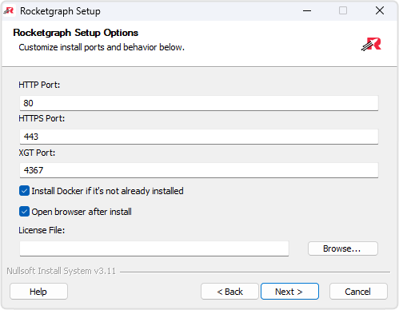

# Options Page

  

On this page, you can customize how Rocketgraph is installed and configured.

---

## ⚙️ Configuration Options

- **HTTP Port**  
  Port used for the Rocketgraph web UI (default: `80`).

- **HTTPS Port**  
  Secure connection port for the web UI (default: `443`).

- **XGT Port**  
  Backend engine port for Rocketgraph queries (default: `4367`).

- 🐳 **Install Docker**  
  Automatically installs Docker if not already present, including:
  - **WSL 2** (Windows Subsystem for Linux)
  - **Virtual Machine Platform**

- 🌐 **Open Browser After Install**  
  Launches the Rocketgraph web UI automatically after installation completes.

- 🔐 **License File**  
  Location of the license file to use. Leave blank if not applicable.

---

Once you've reviewed and adjusted the options, click **Next** to proceed to the [Install Page](install.md).

[← Back to Welcome Page](welcome.md) • [Next → Install Page](install.md)
