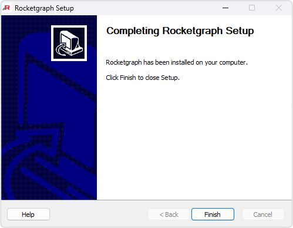
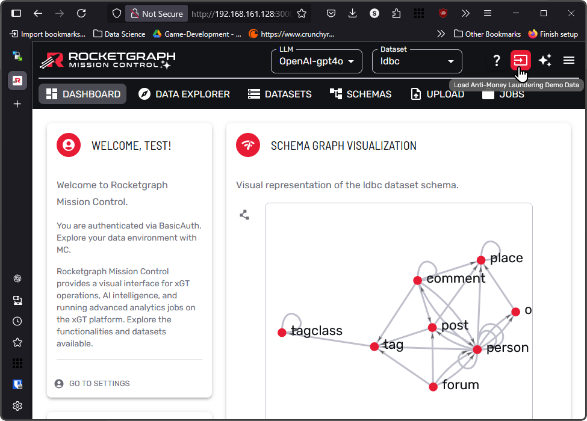

# Installation Complete

  

🚀 Rocketgraph is now ready to launch!

You've successfully completed the installation. Here's what you can do next:

---

## ✅ What You Can Do Now

- Launch the Rocketgraph web interface
- Start your first query
- Check logs and configuration files if you want to customize the setup

---

## 🧭 Next Steps

- Read the [Mission Control Guide](https://github.com/Rocketgraphai/rocketgraph/blob/main/README.md) for an overview of available tools and commands  
- Modify your configuration file to fit your environment  
- Try loading a sample dataset:

  

Just click the **red button** in the upper-right corner, as shown in the image above, to load a sample graph into Rocketgraph.

---

## 🆘 Need Help?

- 🛟 [Contact Support](https://rocketgraph.com/support/)
- 🐛 [Open a GitHub Issue](https://github.com/Rocketgraphai/rocketgraph/issues)

---

[← Back to Install Page](install.md) • [Done — Go to Rocketgraph.com](https://rocketgraph.com/)
