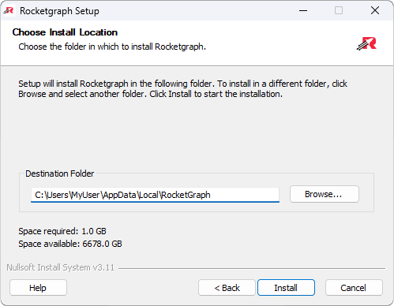

# Install Page

  

On this page, you can choose the install location for Rocketgraph's Docker Compose files.  
By default, the files will be placed in your user directory.

---

Click **Install** to begin setting up Rocketgraph.

---

## ⚙️ What This Step Does

This step will:
- 📦 Copy `.env` and `.yml` files for Docker Compose into your chosen directory
- 🐳 Install Docker Desktop (if not already installed)
- Enable **WSL 2** (Windows Subsystem for Linux)
- Enable **Virtual Machine Platform**
- Start Docker
- 📥 Download Rocketgraph Docker containers (~1 GB)
- 🌐 Launch the web UI on successful setup

> 💡 **Total size required**:  
> ~1 GB for containers  
> ~2 GB additional for Docker Desktop (if installed)

You don’t need to do anything during this step — just sit back and let the installer complete.

---

## 🛠️ Troubleshooting

### 🔁 Reboot Required for WSL 2 or VM Platform

If WSL 2 or the Virtual Machine Platform is not already enabled, the installer will attempt to activate them. This may require a system reboot.

After rebooting, **re-run the installer** to finish setup.

To avoid this, enable these features beforehand via **Windows Features** or PowerShell:

- **Windows Subsystem for Linux**
- **Virtual Machine Platform**

---

### ⚠️ Common Issues

- **Ports in Use**  
  Close any running Docker containers or apps using the selected ports (HTTP/HTTPS/XGT).

- **Missing License File**  
  Make sure you've selected a valid `.lic` license file.

- **Docker Not Starting**  
  If the installer can't start Docker, try launching Docker Desktop manually before running the installer.

- **Slow Docker Installation**  
  If Docker installation is extremely slow, try disabling your antivirus temporarily.

---

[← Back to Options Page](options.md) • [Next → Finish Page](finish.md)
