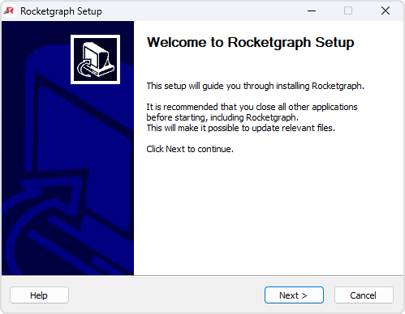

# Welcome Page

  

Welcome to the **Rocketgraph Setup Wizard**! This document explains what you're installing and what to expect during the installation process.

---

## What is Rocketgraph?

**Rocketgraph** is a high-performance graph engine designed for:
- Intuitive query workflows
- Blazing-fast data exploration
- Easy-to-deploy Docker-based architecture

---

## 📦 What’s Included in the Installation:

- Docker Desktop
- WSL 2 (Windows Subsystem for Linux)
- Virtual Machine Platform
- Rocketgraph Docker containers
- Rocketgraph Docker Compose files

---

## ✅ Before You Begin

- Windows 10 or later
- Virtualization enabled in BIOS/UEFI
- License file (if required)
- Internet connection for downloading components

---

Once you're ready, click **Next** on the Welcome page to proceed to the [Options Page](options.md).

[Next → Options Page](options.md)
